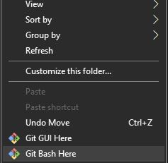

# README
___

[Link to info](#link-to-info)

[Project installation](#Project-installation)

- [How to download the project by using Git SCM](#How-to-download-the-project-by-using-Git-SCM)

___
### Link to info

[info.md](info.md) - (about git commands and markdown)

___
### Project installation
To download the project you will need to have Git SCM or a software that can pull down projects from github.

One way to get git is to download it from the [Git SCM website](https://git-scm.com/downloads).

### How to download the project by using Git SCM
1. Once you have downloaded git try to right click inside the repository that you want to download the project in. 

2. You should see the option "Git Bash Here". Click on it and a git terminal should appear. 

3. Inside the terminal write "git clone (linkThatIsEitherHttpsOrSSH)". Ignore the parenthesis and put the actual link for the project. 

4. You should now be done. Remember that the first time you login you might need to write in your credentials. 

NOTE: Beginning of August 13, 2021, Github will no longer accept account passwords when authenticating Git operations. We will need to use personal access tokens or SSH keys. [Read more about this here.](https://git-scm.com/downloads)
___